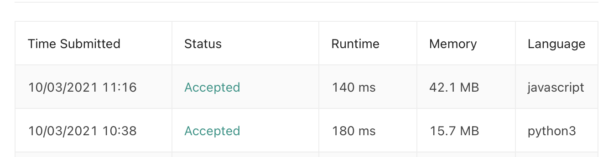

## 
Min Stack

#### 
📚 _LeetCode Problem #26 (**Level Easy**) 10/02/2021_ 

**_
By Daniel Adeyemi_**

---

## 
 🚩 _Description_:

##### **_This is solutions for Leet Code problem [# 26 "Remove Duplicates from Sorted Array"](https://leetcode.com/problems/remove-duplicates-from-sorted-array/)._**

## 
 🤔 Problem description:

Given an integer array nums sorted in non-decreasing order, remove the duplicates in-place such that each unique element appears only once. The relative order of the elements should be kept the same. If there are k elements after removing the duplicates, then the first k elements of nums should hold the final result. It does not matter what you leave beyond the first k elements.

Return k after placing the final result in the first k slots of nums.

## 
 🚥 Tests

## 
 🕰️ 🌌 Time and space complexity:

| Complexity | O()  |                    Explanation                     |
| :--------: | :--: | :------------------------------------------------: |
|    Time    | O(n) |             run through an array once              |
|   Space    | O(1) | we are doing it in place so no more space required |

## 
 🛠️ _Technologies used:_

- Python 3.9
- JavaScript

## 
 🌟 _Teaching points:_

- don't forget to reduce index after removing intger from an array;
- for Python easier use 'while' loop since we can't change index inside for loop

## 
 🌟 _Improvement opportunities:_

- possible use of inbuilt methods like min or sort to make code more succinct.

## 
 📬 Contact Information

#### For any questions _[email author](mailto:adeyemidany+github@gmail.com?subject=[GitHub])_

## 
 📘 _License and copyright:_

> **_© Daniel Adeyemi, 2021_**  
> ⚖️ __
